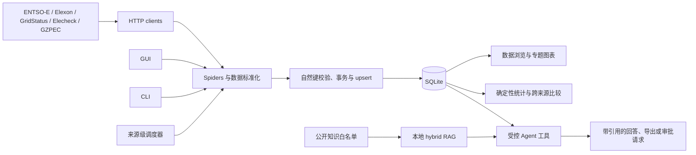

# Powertrade Crawler

[](https://github.com/wsnjxfy/powertrade_crawler/releases/latest)


Powertrade Crawler 是一套面向电力市场学习、研究和数据分析的本地桌面软件。项目将国内外电力
数据采集、SQLite 存储、筛选导出、专题分析、增量调度、受控 Agent、本地混合 RAG 和 Windows
分发整合在同一套应用中。

它已经不只是一个爬虫脚本，而是一套可以在本机完成“采集—存储—浏览—分析—问答—交付”的
电力数据工具。

[下载 Windows 版](https://github.com/wsnjxfy/powertrade_crawler/releases/latest) ·
[用户使用指南](docs/USER_GUIDE_ZH.md) ·
[开发维护与接手指南](docs/DEVELOPER_HANDOVER_GUIDE_ZH.md) ·
[API Key 配置指南](docs/API_KEY_SETUP_GUIDE.md)

## 项目定位

项目主要服务于以下场景：

- 电气工程、电力市场和能源经济方向的教学与学习；
- 国内外电价、负荷、发电、平衡和跨境交换数据的本地研究；
- 现货价格、代理购电和增量机制电价的可视化分析；
- 多来源数据的统一浏览、确定性统计和受控比较；
- Windows 环境下无需部署服务器的离线数据工具交付；
- 在现有框架上继续接入新地区、新数据集或新分析模块。

本项目是本地单用户桌面应用，不是云端多人协作平台。数据库、凭据、Agent 会话和任务记录默认
保存在运行软件的电脑上。

## 已接入的五个数据来源

| 数据来源 | 覆盖范围 | 代表性内容 | 在线采集凭据 | 主要时间口径 |
|---|---|---|---|---|
| ENTSO-E Transparency Platform | 欧洲 | 日前价格、负荷、发电、跨境交换、平衡、停运 | Security Token | 请求和存储以 UTC 为主 |
| Elexon Insights API | 英国 GB | 需求、燃料发电、系统价格、平衡、容量裕度、互联线 | 当前公开接口无需 Key | 日期区间结束边界通常不包含 |
| GridStatus API | 北美 ISO/RTO | 数据集目录、燃料结构、负荷、LMP 等 | API Key | 数据时间统一为 UTC |
| Elecheck 易能电易查 | 中国 | 现货日前/实时价格、代理购电、增量机制电价 | 有效 Authorization | 现货逐日请求，结束日期包含 |
| 广州电力交易中心 | 中国南方区域 | 公开信息、绿证和现货市场周报正文 | 无需凭据 | 以文章发布日期为主 |

不同来源的币种、单位、市场规则、时间粒度和日界并不一致。系统默认保留原始业务口径，不会为了
得到“好看”的跨来源结论而自动换算或补齐不具备业务依据的数据。

## 核心能力

### 数据采集

- 使用官方 API 或公开网页接入五个来源；
- 统一处理超时、连接失败、HTTP 状态码和第三方服务异常；
- 支持分页、游标、时间分块、请求间隔和来源级增量更新；
- 部分 GUI 预览只生成脱敏请求参数、不访问接口；通用 CLI `--dry-run` 可能联网，但不写数据库；
- 使用稳定自然键和 upsert，重复运行不会持续制造重复记录；
- 批量写入失败时通过事务回滚保护数据一致性。

### 本地存储与分析

- 使用 SQLite 和 SQLAlchemy，不要求单独部署数据库服务；
- 为常用筛选、自然键和任务查询建立索引；
- 保留必要原始上下文，同时为常用业务字段建立结构化列；
- 支持表格筛选、CSV 导出、图表 PNG 导出和日维度指标；
- 统计和跨来源比较由确定性工具执行，结果同时说明样本数、时间范围、单位和数据完整度。

### 图形界面

GUI 包含 8 个主要页面：

| 页面 | 主要用途 |
|---|---|
| 数据总览 | 查看五个来源的数据量、覆盖时间和快捷入口 |
| GridStatus | 浏览北美数据集目录，筛选、分页并下载数据 |
| Elecheck 易能电易查 | 国内现货、代理购电、增量机制分析与独立 Agent |
| ENTSO-E 欧洲 | 选择欧洲数据集和区域，预览、采集、浏览及导出 |
| Elexon 英国 | 查询英国需求、发电、价格、平衡和互联线数据 |
| 多数据源 Agent | 跨来源查询、比较、导出、知识检索和受控采集 |
| 定时任务 / 数据维护 | 创建增量任务、查看运行记录和同步 Windows 触发器 |
| API 配置向导 | 查看账号要求，隐藏输入凭据并检测配置状态 |

界面采用响应式网格、滚动区域和统一状态反馈，并考虑最小窗口、高 DPI 和中文显示。网络、模型、
导出等耗时操作在后台执行，Tkinter 控件只由主线程更新；生命周期令牌和任务取消机制用于阻止窗口
关闭后的迟到回调继续修改界面。

## 总体架构



主要代码位于 `src/powertrade_crawler/`：

| 目录或文件 | 职责 |
|---|---|
| `clients/` | 外部 API 和网页请求、重试及异常分类 |
| `spiders/` | 将来源响应转换为内部标准记录 |
| `models.py` | Pydantic 业务模型 |
| `storage.py` | ORM 表、索引、事务、upsert、查询和导出 |
| `metrics.py` | 日维度确定性指标 |
| `app_shell.py`、`*_gui.py` | 桌面壳层、页面和专题看板 |
| `ui_dispatch.py` | 后台任务到 Tk 主线程的安全事件分发 |
| `scheduler.py` | 来源级增量任务、互斥和 Windows 任务计划同步 |
| `agent/` | Elecheck Agent |
| `market_agent/` | 多数据源 Agent、本地 RAG 和跨来源工具 |

更完整的接手地图见[开发维护与接手指南](docs/DEVELOPER_HANDOVER_GUIDE_ZH.md)。

## Agent：不只是调用 LLM

LLM 负责理解问题、生成文字和选择下一步工具；Agent 则在 LLM 外增加了可执行工具、会话状态、
审批、任务时间线、失败规范和权限控制。换句话说，LLM 是推理与表达组件，Agent 是受约束的完整
工作流程。

项目包含两套相互独立的 Agent：

- **Elecheck Agent**：面向国内现货、代理购电和增量机制数据；
- **多数据源 Agent**：面向五个来源的查询、比较、知识检索、导出、采集和调度。

两套 Agent 都只执行注册工具。只读查询和确定性统计可以自动运行；采集、更新数据或创建任务等
操作需要审批，Windows 触发器安装或卸载需要更强确认。Agent 不拥有任意 SQL 写入、Shell、删除
业务数据、任意文件浏览或凭据修改能力，也不会在免费模型不可用时自动切换到付费渠道。

当任务失败或未完成时，回答需要说明：失败原因、是否已经修改数据，以及用户下一步可以怎样处理。

详细设计见 [Agent MVP 指南](docs/AGENT_MVP_GUIDE.md)、
[安全评审](docs/AGENT_SECURITY_REVIEW.md)和[威胁模型](docs/AGENT_THREAT_MODEL.md)。

## 完全本地的混合 RAG

多数据源 Agent 内置本地知识检索，用于查询公开文章、数据集目录和受控请求定义：

- 嵌入模型：`BAAI/bge-small-zh-v1.5`；
- 推理方式：FastEmbed CPU ONNX，冻结版无需联网下载模型；
- 向量存储：`float32` 向量写入 SQLite BLOB；
- 全文检索：SQLite FTS5 `trigram`，适配中文子串；
- 混合召回：向量和全文分别召回，再使用 RRF 融合排序；
- 增量更新：分块内容哈希不变时复用已有向量；
- 发布切换：新代次完整构建后原子切换，失败时保留旧代次；
- 失败降级：向量不可用时明确进入全文检索模式；
- 引用：由工具结果确定性生成，不交给模型自由编造。

知识库只索引白名单中的公开知识，不向量化业务价格时序、凭据、Agent 会话、审批、日志或用户
文件。检索到的正文会被视为不可信外部内容，不能覆盖系统规则或触发工具调用。

完整原理和维护命令见[本地混合 RAG 指南](docs/RAG_GUIDE.md)。

## 快速开始：直接使用 Windows 发布包

### 1. 下载

进入 [GitHub Releases](https://github.com/wsnjxfy/powertrade_crawler/releases/latest)，下载名称类似：

```text
PowertradeCrawler-vX.Y.Z-windows-x64-unsigned.zip
```

Release 页面中的 `Source code (zip)` 是源码快照，不是可直接双击运行的软件。

### 2. 校验文件

在 ZIP 所在目录打开 PowerShell：

```powershell
Get-FileHash .\PowertradeCrawler-v0.1.0-windows-x64-unsigned.zip -Algorithm SHA256
```

`v0.1.0` 发布包的 SHA-256：

```text
E421E3E1DD72AAE5796AB2F0338E16C31FACD2A617DEB0B1E8CA131D44C03330
```

文件名、版本或哈希不一致时不要运行。

### 3. 解压和启动

1. 将 ZIP 完整解压到普通可写目录，支持中文和空格路径；
2. 不要只复制 `PowertradeCrawler.exe`，程序依赖同目录的 `_internal`；
3. 双击 `PowertradeCrawler.exe`；
4. 首次启动后先浏览“数据总览”和内置演示数据；
5. 需要在线采集时，再进入“API 配置向导”配置对应来源。

程序仅在 `data/powertrade.db` 不存在时复制初始数据库，不会覆盖已有用户数据库。

### 4. 关于未签名提示

当前 Windows 发布包没有 Authenticode 代码签名。这是开源分发成本与兼容性的明确取舍，不是程序
功能 Bug，但可能触发浏览器、Microsoft Defender SmartScreen、Smart App Control 或企业应用
控制提示。

请只从本仓库 Release 下载并核对 SHA-256。个人设备在确认来源可信且系统允许时再决定是否运行；
学校或企业受管设备如果被策略阻止，应联系管理员，不要关闭安全软件或绕过单位策略。

完整操作、升级、备份和排障步骤见[中文用户使用指南](docs/USER_GUIDE_ZH.md)。

## 从源码运行

要求 Python 3.11 或更高版本。以下示例使用 Windows PowerShell：

```powershell
git clone https://github.com/wsnjxfy/powertrade_crawler.git
cd powertrade_crawler

python -m venv .venv
.\.venv\Scripts\Activate.ps1
python -m pip install -U pip
python -m pip install -e ".[dev]"
Copy-Item .env.example .env

powertrade init-db
powertrade gui
```

当前正式来源主要使用 API 或普通 HTTP 页面。只有未来接入强依赖浏览器渲染的数据源时才需要：

```powershell
python -m pip install -e ".[browser]"
playwright install chromium
```

## 凭据配置

软件可以在没有任何 API Key 的情况下启动、浏览演示数据和使用本地 RAG。在线能力要求如下：

| 能力 | 是否需要额外配置 |
|---|---|
| Elexon 和广州公开信息采集 | 不需要 Key |
| GridStatus 在线采集 | GridStatus API Key |
| ENTSO-E 在线采集 | Transparency Platform Security Token |
| Elecheck 在线采集 | 有效 Authorization |
| 两套 Agent | 项目外的本机免费 LLM 路由器和至少一个可用免费渠道 |

源码版可使用隐藏输入保存来源凭据：

```powershell
powertrade set-credential gridstatus
powertrade set-credential entsoe
powertrade set-credential elecheck
powertrade credentials-status
```

来源凭据保存在 Git 忽略的 `.auth/credentials.json`。上游 LLM 平台 Key 只配置在项目外的本机
路由器中。不要把真实凭据写入 `.env`、任务参数、数据库、日志、截图、测试或 Git。

申请入口和逐步说明见 [API Key 与账号配置指南](docs/API_KEY_SETUP_GUIDE.md)。

## 常用 CLI

```powershell
# 查看能力
powertrade list-spiders
powertrade help-commands
powertrade credentials-status

# 采集前预览与执行
powertrade crawl gzpec-news-combined --dry-run
powertrade crawl gzpec-news-combined

# ENTSO-E 示例：结束日期不包含
powertrade crawl entsoe_day_ahead_prices --area DE-LU `
  --start-date 2026-06-01 --end-date 2026-06-02 --dry-run

# Elexon 示例
powertrade crawl elexon_system_prices `
  --start-date 2026-06-01 --end-date 2026-06-02 --dry-run

# Agent 和本地 RAG 状态
powertrade agent doctor --json
powertrade market-agent doctor --online
powertrade market-agent rag status --json
powertrade market-agent rag search "绿证交易" --top-k 5 --json

# 调度
powertrade schedule-list
powertrade schedule-run 1 --force
```

更多数据集、参数和来源限制见 [ENTSO-E 指南](docs/ENTSOE_API_GUIDE.md)、
[Elexon 指南](docs/ELEXON_API_GUIDE.md)和[用户使用指南](docs/USER_GUIDE_ZH.md)。

## 调度与自动更新

调度器支持来源级增量任务：

- 每次运行时重新计算日期窗口；
- 同一任务通过线程级和进程级互斥避免重复执行；
- 一个来源中的子步骤失败不会阻断其他步骤，结果标记为 `partial`；
- 本地启用状态与 Windows 触发器安装状态分别管理；
- 任务参数递归拒绝 API Key、Token、Authorization、Password 和 Secret；
- 冻结版和源码版都支持 GUI 关闭后的 Windows 任务计划运行。

具体创建、验收和排障方式见[调度验收报告](docs/SCHEDULE_ACCEPTANCE_REPORT.md)。

## 质量与验收基线

`v0.1.0` 最终发布门禁记录了以下结果：

| 检查项 | 结果 |
|---|---:|
| Pytest（`-W error`） | 319 项通过 |
| Ruff / Python 编译检查 | 通过 |
| 依赖兼容检查 | 66 个包兼容 |
| 多数据源 Agent 离线评测 | 17/17 |
| Elecheck Agent 离线评测 | 9/9 |
| RAG 离线评测 | 60/60 |
| RAG Recall@5 / MRR@5 | 100% / 0.9743 |
| RAG 过滤正确率 / 引用有效率 | 100% / 100% |
| RAG 无结果误命中率 | 0% |
| 冻结态知识库 | 1410 个文档、2851 个分块 |

在最终验收环境中，RAG 完整重建约 65.94 秒，暖查询 P95 约 0.1 秒；这些时间属于特定机器上的
测量值，不应视为所有设备的性能保证。

自动化发布验收还覆盖了中文空格路径、离线首次启动、8 页面 GUI、冻结态 hybrid RAG、初始数据库
只首次复制，以及敏感文件排除。该验收通过复制到全新目录模拟干净环境，但不等同于已经在所有
物理干净机、学校网络或企业应用控制策略中完成验证。

详见[最终交付指南](docs/FINAL_DELIVERY_GUIDE.md)、
[Agent 真实评测报告](docs/AGENT_REALISTIC_EVAL_REPORT.md)和
[Windows 发布门禁](docs/WINDOWS_RELEASE_GATE.md)。

## 开发与接手

开发者在修改前应先阅读：

1. [开发维护与接手指南](docs/DEVELOPER_HANDOVER_GUIDE_ZH.md)
2. [AGENTS.md](AGENTS.md)
3. 与任务相关的专项指南、源码和测试

提交前的完整质量检查：

```powershell
.\.venv\Scripts\python.exe -m ruff check src tests scripts
.\.venv\Scripts\python.exe -m pytest -q -W error
.\.venv\Scripts\python.exe -m compileall src
git diff --check
```

新增数据源时，应把 client、spider、业务模型、自然键、存储、注册表、CLI/GUI、调度、Agent 工具、
测试、文档和冻结资源看作一条完整交付链路，而不是只增加一个请求函数。

## 项目目录

```text
powertrade_crawler/
├─ src/powertrade_crawler/   # 主程序
├─ tests/                    # 自动化测试
├─ configs/                  # 受控数据集和请求定义
├─ docs/                     # 用户、开发、安全、RAG 和发布文档
├─ scripts/                  # 模型准备、接口探测和发布验收脚本
├─ desktop_launcher.py       # Windows 桌面与 headless 入口
├─ PowertradeCrawler.spec    # PyInstaller 配置
└─ pyproject.toml            # Python 项目和依赖配置
```

本地运行会产生 `.auth/`、`data/`、`exports/`、`work/`、`build/` 和 `dist/` 等目录；这些目录
可能包含凭据、用户数据或大型产物，不应提交到 Git。

## 当前限制

- 在线结果受第三方接口、账号权限、套餐、限流和网页结构变化影响；
- ENTSO-E 当前统一保存 UTC，尚未为所有区域自动换算当地交易日；
- Elecheck Authorization 需要由有权访问该服务的用户自行提供；
- 广州公开信息中的图片只保存 URL，不下载图片，也不执行 OCR；
- Agent 只能使用注册工具，不是任意电脑操作助手；
- Windows 包未签名，不能保证通过所有 SmartScreen 或企业应用控制策略；
- 自动化验收不能证明软件在所有硬件、网络和第三方环境中都不存在问题。

## 文档索引

- [中文用户使用指南](docs/USER_GUIDE_ZH.md)
- [中文开发维护与接手指南](docs/DEVELOPER_HANDOVER_GUIDE_ZH.md)
- [最终交付使用与验收指南](docs/FINAL_DELIVERY_GUIDE.md)
- [API Key 与账号配置指南](docs/API_KEY_SETUP_GUIDE.md)
- [ENTSO-E 数据集指南](docs/ENTSOE_API_GUIDE.md)
- [Elexon 数据集指南](docs/ELEXON_API_GUIDE.md)
- [Agent MVP 指南](docs/AGENT_MVP_GUIDE.md)
- [Agent 安全评审](docs/AGENT_SECURITY_REVIEW.md)
- [Agent 威胁模型](docs/AGENT_THREAT_MODEL.md)
- [Agent 真实评测报告](docs/AGENT_REALISTIC_EVAL_REPORT.md)
- [本地混合 RAG 指南](docs/RAG_GUIDE.md)
- [调度验收报告](docs/SCHEDULE_ACCEPTANCE_REPORT.md)
- [Windows 发布门禁](docs/WINDOWS_RELEASE_GATE.md)
- [RAG 第三方许可说明](docs/THIRD_PARTY_NOTICES_RAG.md)

## 许可与第三方组件

仓库包含 RAG 模型和相关组件的第三方许可说明，详见
[THIRD_PARTY_NOTICES_RAG.md](docs/THIRD_PARTY_NOTICES_RAG.md)。

当前仓库根目录尚未提供主项目 `LICENSE` 文件。公开可见的 GitHub 仓库并不自动授予复制、修改或
再分发权利；如需在教学提交之外进行协作、二次开发或再分发，请先与项目所有者确认许可范围。
