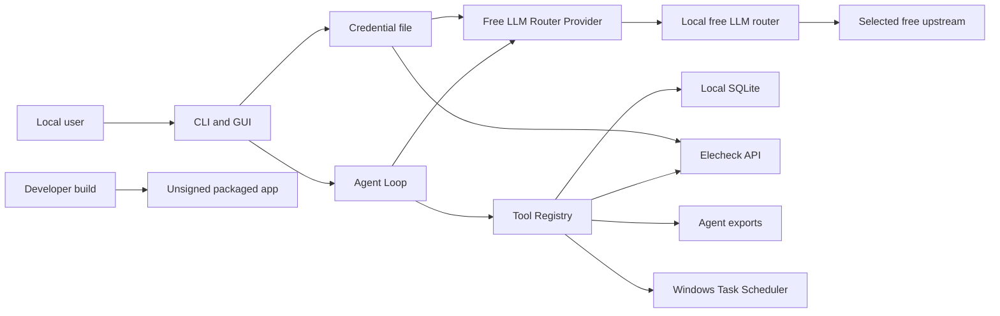

# Elecheck Agent 威胁模型

## 多数据源 Agent 本地知识检索边界

RAG 新增的资产只有公开知识文本、本地 ONNX 模型和可重建索引。主要威胁为文章正文提示
注入、伪造引用、模型文件篡改、索引损坏和敏感表误入语料。缓解措施分别为不可信内容
标记与系统提示、程序确定性引用交集、模型 SHA-256 清单、代次原子切换，以及四个显式
语料提取器的来源/内容类型白名单。该能力不获得网络采集、任意文件或数据库写权限。

> 2026-08-03 更新：模型出口已从硅基流动直连改为本机回环地址上的免费 LLM 统一网关。
> 免费池 Key 只从项目外 `client-free.env` 读取，固定渠道必须为可用免费渠道，且不存在
> 付费回退。下文所有“第三方模型服务”均指由该本地路由器实际选择的免费上游渠道。

## Executive summary

该 Agent 是无入站网络接口的单用户 Windows 桌面/CLI 工具，远程攻击面明显小于 Web
服务。最重要的风险集中在三个边界：本地明文凭据与 SQLite 文件、经免费路由器发送的用户
问题及 Elecheck 工具结果、以及模型提出写操作后到用户审批和实际执行之间的完整性。
仓库已通过本机回环地址限制、固定工具 allowlist、严格 Pydantic Schema、分级审批、参数摘要、
幂等状态、统一脱敏和执行轨迹降低风险。结合用户确认的本地普通用户部署方式，目前没有
critical 风险；剩余重点是防止操作者误把敏感数据输入第三方模型、保护本地 Windows
账户，以及为未签名打包产物建立可信分发方式。

## Scope and assumptions

范围：

- Agent 运行时：`src/powertrade_crawler/agent/`
- 免费路由器客户端：`src/powertrade_crawler/llm_router.py`
- 凭据：`src/powertrade_crawler/credentials.py`
- Agent SQLite 表：`src/powertrade_crawler/storage.py`
- Elecheck 采集和调度复用：`src/powertrade_crawler/scheduler.py`
- CLI/GUI：`src/powertrade_crawler/cli.py`、`src/powertrade_crawler/gui.py`
- 打包和依赖：`PowertradeCrawler.spec`、`desktop_launcher.py`、`pyproject.toml`

已由项目所有者确认：

- 仅作为单用户本地 Windows 桌面/CLI 工具，不监听端口、不提供公网入站服务、不是多租户。
- 数据库可能包含个人信息、客户数据或未公开商业数据。
- Windows 任务计划始终使用当前普通用户身份，不使用管理员服务账户。

重要范围限制：

- Agent 没有任意可写 SQL、Shell、任意文件读取、业务数据删除、任务删除、数据库维护、
  凭据修改或跨数据源工具。受控只读 SQL 仅开放 Elecheck 表/字段白名单，排除
  `raw_json`、Agent 会话和其他敏感表。
- Agent 会把用户问题和固定 Elecheck 工具的脱敏结果经本地路由器发送给免费上游渠道。用户主动粘贴的
  敏感内容仍可能离开本机。
- `.auth/`、`data/`、`dist/` 和本机操作系统安全不属于远程服务边界，但属于本地威胁。

仍会显著改变风险排名的开放问题：

- 若以后把 GUI/CLI 包装成网络服务、允许多用户访问或加入任意数据库/RAG 工具，必须
  重新建模认证、授权、租户隔离和敏感数据出境。
- 若正式分发 EXE，需要确定代码签名证书、更新渠道和发布物校验流程。

## System model

### Primary components

- 用户界面：Typer CLI 和 Tkinter GUI，接收问题、模型设置和审批决定。
- Agent Loop：最多 8 次模型调用，解析原生 `tool_calls` 或严格 JSON Action。
- Provider：使用 `httpx` 调用本机回环地址上的 OpenAI 兼容免费 LLM 路由器。
- Tool Registry：显式注册 Elecheck 工具并使用 Pydantic 拒绝未知工具和额外参数。
- Agent Repository：在本地 SQLite 保存非敏感配置、会话、消息、运行、事件和工具调用。
- Elecheck 工具：复用已有分析 repository、spider、upsert 和调度校验。
- 凭据文件：项目外 `client-free.env` 保存本地免费池 Key；`.auth/credentials.json` 保存
  Elecheck Authorization 等业务数据源凭据。
- 操作系统边界：预设目录导出和普通用户权限下的 Windows `schtasks`。
- 构建边界：Python 依赖、PyInstaller 和未签名本地发布物。

### Data flows and trust boundaries

- 用户 → CLI/GUI：自然语言、会话 ID、非敏感模型设置和审批决定；进程内调用；CLI
  参数、Pydantic 模型和显式确认负责校验。
- CLI/GUI → Agent Loop：用户问题和停止信号；进程内调用；消息写库前脱敏，隐藏推理
  不展示。
- Agent Loop → 本地免费路由器：系统提示、用户问题、工具 Schema、脱敏工具结果；HTTP
  Bearer；主机只允许回环地址，有超时和一次无副作用重试；路由器再调用实际免费上游。
- Agent Loop → Tool Registry：模型生成的工具名和参数；进程内调用；未知工具、额外
  字段和类型错误被拒绝；单次模型响应最多八个工具，按顺序执行并逐项暂停审批。
- Tool Registry → SQLite：固定 Elecheck 分析、受控只读 SQL、会话和审计状态；
  只读 SQL 使用 `mode=ro`、`query_only`、authorizer、行数与执行时间限制；业务写入
  仍只复用经过审批的固定 upsert。
- Tool Registry → Elecheck：明确地区/日期/月范围和 Elecheck Authorization；HTTPS；
  单地区 31 天、代理购电 24 个月和 spider allowlist 校验；全部现货更新需普通审批，
  地区目录和逐地区起始日期由本地固定规则计算。
- Agent Repository → 凭据文件：只读取 configured credential；本地文件；密钥不写入
  SQLite、提示词、事件或报告。
- 用户审批 → 写工具：工具名、规范化参数、SHA-256 摘要和副作用；本地 GUI/CLI；
  参数变化使审批失效，Windows 操作要求二次确认。
- 写工具 → Windows Task Scheduler：任务 ID 和构造好的参数列表；本地子进程；
  `subprocess.run` 不使用 shell，并继承当前普通用户权限。
- 导出工具 → 文件系统：分析 CSV/PNG；固定 `exports/agent/<session>/`；模型不能传入路径。
- 开发者 → 构建产物：源码、第三方包和 PyInstaller；本地构建；当前没有代码签名和
  完整发布供应链证明。

#### Diagram

## Assets and security objectives

| Asset | Why it matters | Security objective (C/I/A) |
|---|---|---|
| 本地免费池 Key | 可代表应用访问免费路由器并消耗免费额度 | C/I/A |
| Elecheck Authorization | 可代表用户访问 Elecheck 接口 | C/I/A |
| 用户问题和会话 | 可能包含个人、客户或未公开商业信息 | C/I |
| Elecheck 市场数据和分析结果 | 业务判断依赖数值和口径准确 | I/A |
| 其他本地数据库数据 | 用户确认可能包含敏感数据，但当前 Agent 工具不可访问 | C/I |
| 审批决定和参数摘要 | 决定写操作是否可执行及执行何种参数 | I |
| 工具调用状态和审计事件 | 用于恢复、追责和防止重复执行 | I/A |
| 定时任务定义和 Windows 任务 | 影响未来自动网络访问和数据库写入 | I/A |
| CSV/PNG 导出 | 可能被外发或用于业务汇报 | C/I |
| 模型配额与账户余额 | 循环、超时或滥用会产生费用和可用性损失 | A |
| 源码和打包产物 | 被篡改会绕过全部应用内控制 | I/A |

## Attacker model

### Capabilities

- 恶意或被诱导的本地操作者可以输入提示词、选择会话、请求动作并决定是否审批。
- 获得当前 Windows 用户权限的恶意程序可以尝试读取 `.auth`、SQLite、导出和未签名 EXE。
- 模型服务或被污染的模型输出可以返回未知工具、伪造参数、重复调用、无效 JSON 或
  提示注入式文本。
- 被攻击或异常的 Elecheck 服务可以返回恶意字符串、极端数值、错误数据或超大响应。
- 供应链攻击者可以尝试污染未精确锁定的 Python 依赖或替换未签名分发包。

### Non-capabilities

- 远程攻击者不能直接连接本应用：没有监听端口、HTTP route、RPC 或消息队列消费者。
- 普通模型输出不能注册新工具、调用 Shell/SQL、读取任意文件、读取凭据值或跳过审批。
- 普通 Windows 用户权限下的任务不能自动获得管理员权限。
- 当前没有第二个租户或远程用户，因此跨租户数据访问不适用。
- 仅控制公开 Elecheck 数据内容的攻击者不能直接修改 Agent SQLite 审批状态。

## Entry points and attack surfaces

| Surface | How reached | Trust boundary | Notes | Evidence (repo path / symbol) |
|---|---|---|---|---|
| `powertrade agent` CLI | 本地命令行 | 用户 → 应用 | chat/config/sessions/approvals/tools/eval | `src/powertrade_crawler/agent/cli.py::agent_app` |
| 智能 Agent GUI | Tkinter Elecheck 页签 | 用户 → 应用 | 后台线程、停止、审批、模型设置 | `src/powertrade_crawler/agent/gui.py::ElecheckAgentApp` |
| 模型响应 | 本地路由器与免费上游 | 第三方服务 → Agent | 原生和 JSON 两种不可信协议 | `src/powertrade_crawler/agent/provider.py::FreeLLMRouterProvider.complete` |
| Provider Endpoint | 项目外配置 | 操作者配置 → 凭据边界 | 错误主机可能窃取 Key，现已锁定本机回环地址 | `src/powertrade_crawler/llm_router.py::load_free_router_config` |
| 工具名和参数 | 模型响应 | 模型 → 本地能力 | Pydantic `extra=forbid` 和显式 registry | `src/powertrade_crawler/agent/tools.py::ToolRegistry` |
| 审批恢复 | CLI/GUI | 用户决定 → 写工具 | 绑定工具调用 ID 和参数摘要 | `src/powertrade_crawler/agent/repository.py::decide_approval` |
| Elecheck API 数据 | 外部 HTTPS | 数据源 → 分析工具 | 工具结果在进模型前递归脱敏 | `src/powertrade_crawler/agent/elecheck_tools.py` |
| 免费池环境文件 | 项目外本地文件 | 文件系统 → Provider | 明文、不进入项目与 Git | `src/powertrade_crawler/llm_router.py::load_free_router_config` |
| 业务凭据 JSON | 本地文件 | 文件系统 → 数据源 Client | 明文、Git 忽略、尽力限制权限 | `src/powertrade_crawler/credentials.py::save_credential` |
| Agent SQLite 表 | 本地文件 | 应用 → 持久状态 | 会话、运行、事件、工具调用 | `src/powertrade_crawler/storage.py::AgentRunRow` |
| 导出路径 | 自动工具 | 应用 → 文件系统 | 固定目录、微秒时间戳、无用户路径参数 | `src/powertrade_crawler/agent/elecheck_tools.py::_export_path` |
| Windows `schtasks` | 强化审批工具 | 应用 → OS | 参数列表、无 shell、普通用户权限 | `src/powertrade_crawler/scheduler.py::install_windows_task` |
| 评测 fixture | 本地 CLI | 开发/测试 → 模型和 SQLite | 动作案例只停在审批 | `src/powertrade_crawler/agent/evaluation.py::load_live_cases` |
| PyInstaller EXE | 本地分发 | 构建环境 → 用户设备 | 当前未签名，最终 smoke 被应用控制策略阻止 | `PowertradeCrawler.spec` |

## Top abuse paths

1. 攻击者诱导用户把客户数据粘贴进 Agent → 文本通过 HTTPS 发给第三方模型 →
   敏感信息离开本地控制范围。
2. 本地恶意程序取得当前用户权限 → 读取 `.auth/credentials.json` → 盗用
   免费模型额度或 Elecheck Authorization。
3. 恶意模型输出伪造采集参数 → 尝试把单地区请求扩大为全部地区或超长日期 →
   单地区工具由 Pydantic 拒绝；合法的全部地区更新必须改用独立审批工具，模型只能
   提供结束日期，地区目录和逐地区起始日期由本地规则计算。
4. 模型在用户批准后更换参数 → 使用原工具调用 ID 恢复 → 参数 SHA-256 不匹配，
   旧审批失效。
5. 写工具在外部请求后进程崩溃 → 程序重启尝试恢复 → executing/failed 状态阻止自动
   重试，避免不确定状态下重复副作用。
6. 恶意 Elecheck 字符串伪装成系统指令 → 作为工具结果进入模型 → 系统提示和
   `untrusted_tool_result` 标记要求仅作为数据使用，且其内容不能注册能力。
7. 本地攻击者直接篡改 SQLite 审批或审计行 → 再从 CLI 恢复执行 → 应用缺少防篡改
   签名，可能信任伪造状态；前提是攻击者已拥有本地数据库写权限。
8. 攻击者替换未签名 EXE 或污染依赖 → 用户运行被篡改版本 → 应用内审批和脱敏可被
   完全绕过。

## Threat model table

| Threat ID | Threat source | Prerequisites | Threat action | Impact | Impacted assets | Existing controls (evidence) | Gaps | Recommended mitigations | Detection ideas | Likelihood | Impact severity | Priority |
|---|---|---|---|---|---|---|---|---|---|---|---|---|
| TM-001 | 操作者错误、提示注入 | 用户把敏感数据输入聊天；或未来工具返回敏感字段 | 将个人、客户或未公开数据发送给免费上游模型 | 第三方披露、合同或隐私风险 | 用户问题、敏感数据 | Agent 仅有 Elecheck allowlist 工具；SQL 只读且限制表/字段；消息和工具结果脱敏（`agent/tools.py`、`agent/elecheck_tools.py`、`agent/security.py`） | 无通用 DLP，无法识别所有商业秘密 | GUI/CLI 明示禁止粘贴敏感数据；为敏感环境增加本地模型或发送前数据分类/确认；保持工具最小化 | 记录脱敏命中次数和工具字段清单，不记录原文 | low | high | medium |
| TM-002 | 本地恶意程序 | 已获得当前 Windows 用户读取权限 | 读取明文 `client-free.env` 或 `.auth` 并盗用 Key/token | 免费额度、数据源滥用 | 两类凭据、模型配额 | 配置文件在项目外；`.auth` Git 忽略；不写数据库/日志；`chmod` 尽力收紧（`credentials.py`） | Windows `chmod` 不等价于 ACL，未使用系统凭据库 | 使用 Windows Credential Manager/DPAPI；支持轮换和撤销；为额度设置限额 | 监控免费路由器告警和异常时间段；只记录配置状态，不记录值 | low | high | medium |
| TM-003 | 恶意或异常模型 | 模型能生成任意工具名和 JSON 参数 | 调用未授权能力或构造额外参数 | 非预期本地/网络操作 | 数据库完整性、任务状态 | 显式 Elecheck registry、未知工具拒绝、Pydantic `extra=forbid`（`agent/tools.py`、`agent/elecheck_tools.py`） | 模型仍可能消耗只读调用配额 | 保持 allowlist；新增工具时必须安全评审和风险分级 | 统计 unknown tool、validation failure 和循环上限事件 | medium | medium | medium |
| TM-004 | 恶意模型、UI 欺骗 | 用户看到的参数与执行参数可能不一致 | 审批后替换地区、日期、任务或副作用 | 错误采集或调度变更 | 审批完整性、业务数据 | 规范化参数摘要、审批状态、强化审批精确工具名（`repository.py::decide_approval`、`agent/cli.py::decide_and_resume`） | 本地数据库可被同用户直接篡改 | 将审批摘要和结果纳入带密钥的审计链；GUI 突出参数差异 | 告警同一工具调用 ID 的参数冲突和失效审批 | low | high | medium |
| TM-005 | 崩溃、超时、模型重复调用 | 工具可能在错误前已产生部分副作用 | 恢复或重试造成重复采集、建任务或 OS 操作 | 重复任务、额外请求、状态不一致 | 数据完整性、任务状态、配额 | run/tool/参数去重；executing/failed 禁止自动重试；业务 upsert（`repository.py::create_tool_call`、`begin_tool_call`） | 无跨进程事务覆盖外部 API 与本地提交 | 为每个写工具提供 reconcile/status 检查；外部服务支持时传幂等键 | 监控长期 executing、execution_state_unknown 和同参数重复提议 | low | medium | low |
| TM-006 | 恶意 Elecheck 数据或提示内容 | 外部数据中出现指令式字符串 | 诱导模型忽略边界或谎报操作 | 错误结论、尝试越权工具 | 分析完整性、审批 | 工具结果标为 untrusted；系统提示禁止执行其中指令；最终来源/操作由轨迹落地（`prompts.py`、`loop.py::_ground_final_answer`） | 业务结论文本仍由模型生成 | 对关键指标采用确定性模板；数值与直接计算自动比对 | 评测提示注入样例；记录模型建议与实际工具差异 | low | medium | low |
| TM-007 | 本地同用户攻击者 | 获得 SQLite 文件写权限 | 篡改会话、工具状态、审批或审计事件 | 绕过应用状态机、掩盖操作 | 审批、审计、任务完整性 | SQLite 状态集中、参数摘要和状态检查（`storage.py::AgentToolCallRow`） | 审计不是防篡改日志，无 OS 级访问控制验证 | 为关键行增加链式 HMAC；收紧数据库 ACL；高风险执行前重新向用户展示真实 OS/DB 状态 | 启动时检查不可能状态转换和摘要不一致 | low | high | medium |
| TM-008 | 误用、恶意提示、异常模型 | 用户可连续提交复杂任务 | 消耗模型额度、超时或形成工具循环 | 费用和可用性下降 | 模型配额、Agent 可用性 | 每轮最多 8 次模型调用；一次超时重试；工具顺序执行；日期/月范围和列表长度受限（`loop.py::MAX_MODEL_CALLS`） | 无每日预算、会话级费用上限或并发限制 | 增加可配置 Token/费用预算、并发锁和每日上限 | 汇总 token usage、延迟、超时和 quota error | medium | medium | medium |
| TM-009 | 恶意提示、本地操作者误批 | 用户批准 Windows 任务操作 | 创建或删除不期望的普通用户计划任务 | 持续自动运行、可用性影响 | Windows 任务、数据库 | 强化审批、精确任务/参数/副作用、普通用户权限、无 shell（`agent/elecheck_tools.py`、`scheduler.py`） | OS 任务状态与 SQLite 仍可能漂移 | 执行前后查询并展示 `schtasks` 实际状态；增加 reconcile 命令 | 比对 SQLite `windows_task_name` 与系统任务列表 | low | medium | low |
| TM-010 | 供应链攻击者 | 依赖安装或分发渠道被控制 | 污染 Python 包或替换未签名 EXE | 任意本地代码执行，绕过全部控制 | 凭据、数据库、源码、用户设备 | PyInstaller 固定 spec；本地测试和 hash 可生成（`PowertradeCrawler.spec`、`pyproject.toml`） | 依赖仅最低版本约束；无 lock/SBOM/签名；最终 EXE 被本机策略阻止 | 使用锁文件和哈希、生成 SBOM、代码签名、发布 SHA-256、可信更新渠道 | CI 依赖扫描、构建 provenance、用户侧签名验证 | low | high | medium |

## Criticality calibration

- critical：无需本地账户或用户批准即可远程执行任意代码；远程批量读取凭据和敏感
  数据；可静默安装管理员级持久化。目前架构没有这类入口。
- high：在现实前提下泄露大量客户/未公开数据；绕过审批执行大范围写操作；替换可信
  发布物并窃取所有凭据。需要优先修复或改变部署。
- medium：需要本地普通用户权限、用户误操作或第三方服务异常，可能泄露单次敏感输入、
  篡改本地审计或消耗显著额度；官方 Endpoint 限制、allowlist 和审批降低了概率。
- low：只造成可恢复的重复查询、单次失败、少量费用、普通用户范围内且容易发现的任务
  状态漂移。

针对本项目的例子：

- critical：新增无认证公网接口并暴露任意 Shell；模型无需审批即可安装管理员任务。
- high：未来开放不受限 SQL/RAG 后把整个含客户数据的数据库发给模型；恶意更新包读取 `.auth`。
- medium：用户把单份未公开材料粘贴到聊天；同用户恶意程序篡改审批库；无限模型循环
  造成显著账单。
- low：重复只读查询；被拒绝的额外参数；普通用户任务安装失败并留下可见错误。

## Focus paths for security review

| Path | Why it matters | Related Threat IDs |
|---|---|---|
| `src/powertrade_crawler/agent/provider.py` | API Key 发送目标、请求头、超时和响应解析 | TM-001, TM-002, TM-008 |
| `src/powertrade_crawler/agent/loop.py` | 模型/工具状态机、结构化输出、恢复和重复执行 | TM-003, TM-004, TM-005, TM-006 |
| `src/powertrade_crawler/agent/tools.py` | 所有工具的 Schema 校验和执行 choke point | TM-003, TM-006 |
| `src/powertrade_crawler/agent/elecheck_tools.py` | 能力 allowlist、范围限制、导出和调度副作用 | TM-003, TM-005, TM-009 |
| `src/powertrade_crawler/agent/repository.py` | 审批摘要、幂等状态和本地审计完整性 | TM-004, TM-005, TM-007 |
| `src/powertrade_crawler/agent/security.py` | 所有消息、工具结果和事件的脱敏 | TM-001, TM-002 |
| `src/powertrade_crawler/agent/prompts.py` | 提示注入和动作/审批语义 | TM-003, TM-006 |
| `src/powertrade_crawler/agent/cli.py` | 直接用户审批、强化确认和 JSON 错误契约 | TM-004, TM-009 |
| `src/powertrade_crawler/agent/gui.py` | 后台线程、停止、设置和审批显示 | TM-004, TM-008, TM-009 |
| `src/powertrade_crawler/credentials.py` | 本地明文凭据和文件权限 | TM-002 |
| `src/powertrade_crawler/storage.py` | Agent 表结构及审批/审计资产 | TM-005, TM-007 |
| `src/powertrade_crawler/scheduler.py` | Windows 子进程和现有调度校验 | TM-005, TM-009 |
| `src/powertrade_crawler/agent/evaluation.py` | 在线动作案例不得批准，报告不得含秘密 | TM-003, TM-008 |
| `pyproject.toml` | 依赖约束和供应链输入 | TM-010 |
| `PowertradeCrawler.spec` | 打包数据、隐藏导入和未签名产物 | TM-010 |

## Quality check

- [x] 覆盖 CLI、GUI、模型、Elecheck、SQLite、凭据、导出、Windows 调度和构建入口。
- [x] 每个跨信任边界的数据流至少对应一个具体威胁。
- [x] 区分运行时、测试评测、开发构建和分发风险。
- [x] 使用项目所有者确认的单用户、敏感数据和普通用户任务上下文。
- [x] 没有假设 Agent 能访问未注册的其他数据库表。
- [x] 明确记录未签名 EXE、Windows 本地明文凭据和第三方模型数据边界的残余风险。
